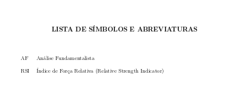
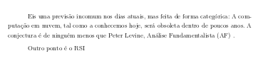
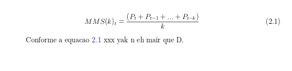
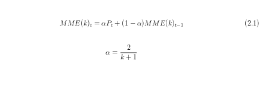
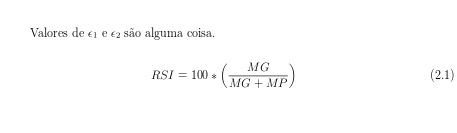
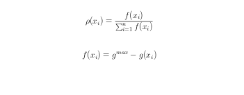
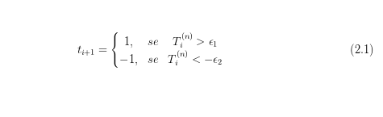
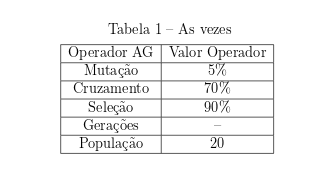
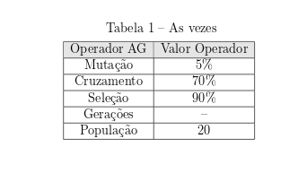
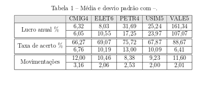

## Ajudar com a escrita de conteúdo usando latex no [sharelatex](https://www.sharelatex.com)

Indico colocar os imports de pacotes todos no mesmo lugar e usar comentarios.

### lista automática de simbolos
1 - Importe o pacote (dentro de main.tex)

```tex
% ---
% ###############################
% # seus pacotes ################
% ###############################
% lista automatica --
\usepackage{nomencl}
% --
% # end pacote      #############
```
--
2  - Imprimir a lista de abreviatura (deve estar no mesmo fluxo dos outros conteúdos)

```tex
\makenomenclature
\renewcommand{\nomname}{LISTA DE SÍMBOLOS E ABREVIATURAS}
\printnomenclature
\cleardoublepage
```


--
3 - Usar a nomenclatura

```tex
%% usar a nomeclatura automatica
%% (vai ser ordenado por ordem alfabética
%%  o que estiver dentro \nomenclature{CB}{Caixa Branca} vai para o área de impresão
%% )

Eis uma previsão incomum nos dias atuais, mas feita de forma categórica: A computação em nuvem, tal como a conhecemos hoje, será obsoleta dentro de poucos anos. A conjectura é de ninguém menos que Peter Levine, Análise Fundamentalista (AF) \nomenclature{AF}{Análise Fundamentalista}.

Outro ponto é o RSI \nomenclature{RSI}{Índice de Força Relativa (Relative Strength Indicator)}

```


### fórmulas

```tex
\begin{equation}
\label{eq:mms} % label-nome
% x_{y} -> gera subindice
% \frac{numerador}{denominador}
MMS (k)_{t} = \frac{(P_{t} + P_{t-1} + . . . + P_{t-k})}{k}
\end{equation}

% \ref{label-nome} referencia a formula no texto de forma automatica
Conforme a equacao \ref{eq:mms} xxx yak n eh mair que D.
```



--

```tex
\begin{equation}
\label{eq:mme}
% letras especiais tipo \alpha tem varias outras
MME (k)_{t} = \alpha P_{t} + (1-\alpha)MME(k)_{t-1}
\end{equation}

% $$ formula $$ -> tipo uma formula inline, mais facil de fazer 
$$ \alpha = \frac{2}{k+1} $$
```



--

```tex
% $ formula $ -> insere formula no proprio texto
Valores de $\epsilon_{1}$ e $\epsilon_{2}$ são alguma coisa.

% essa formula eh mais complexa porque tem o conceito de matriz com \left ( -> insere '('
\begin{equation}
\label{eq:rsi}
RSI = 100 * \left (\frac{MG}{MG+MP} \right )
\end{equation}
```



--

```tex
\begin{equation}
    \label{eq:proporcao}
    % somatorio \sum_{parte-baixo}^{parte-cima}
    \rho(x_{i}) = \frac{f(x_i)}{\sum_{i=1}^n{f(x_i)}}
\end{equation}

\begin{equation}
    \label{eq:proporcao-intermediario}
    % potência x^{header}
    f(x_i) = g^{max} - g(x_i)
\end{equation}
```



--

```tex
% \usepackage{amsmath} -- precisa desse pacote pra funcionar
% essa eh realmente uma matriz
% o conceito eh parecido com uma tabela
% células são separadas por & e quebra de linha usa \\
\begin{equation}
\label{eq:regraIndicadorTecnico}
t_{i+1} = \left \{ 
         \begin{matrix} 
           1, & se & T_{i}^{(n)} > \epsilon_{1} \\
           -1, & se & T_{i}^{(n)} < -\epsilon_{2}
         \end{matrix} 
         \right. 
\end{equation}
```




### tabelas

```tex
% tabela normal

\begin{table}[ht]
    \centering
    \caption{As vezes }
    \begin{tabular}{|c|c|} \hline
         Operador AG & Valor Operador  \\ \hline
         Mutação & 5\%  \\ \hline
        Cruzamento & 70\% \\ \hline
        Seleção & 90\% \\ \hline
        Gerações & -- \\ \hline 
        População & 20\\ \hline
    \end{tabular}
    \label{tb:wang1}
\end{table}
```



--

```tex
% pacotes necessários

% ###############################
% # seus pacotes ################
% -- usar cor na tabela
\usepackage[table]{xcolor}
\definecolor{lgray}{RGB}{230,230,230}
% --
% ###############################
% # end pacote      #############


% uso

% tabela normal, com título em destaque
% basta chamar a cor definida antes da linha \rowcolor{lgray}
\begin{table}[ht]
    \centering
    \caption{As vezes }
    \begin{tabular}{|c|c|} \hline
        \rowcolor{lgray}
        Operador AG & Valor Operador  \\ \hline
        Mutação & 5\%  \\ \hline
        Cruzamento & 70\% \\ \hline
        Seleção & 90\% \\ \hline
        Gerações & -- \\ \hline 
        População & 20\\ \hline
    \end{tabular}
    \label{tb:wang1}
\end{table}
```



--
```tex
% pacotes necessários

% ###############################
% # seus pacotes ################
% -- tabela complexa com mesclagem
\usepackage{booktabs}
\usepackage{multirow}
% --
% -- usar cor na tabela
\usepackage[table]{xcolor}
\definecolor{lgray}{RGB}{230,230,230}
% --
% ###############################
% # end pacote      #############


% uso

% tabela complexa com mesclagem (cor do exemplo anterior)
\begin{table}[ht]
    \centering
    \caption{Média e desvio padrão com --.}
    \begin{tabular}{|c|c|c|c|c|c|}\hline
        \rowcolor{lgray}
        & CMIG4 & ELET6 & PETR4 & USIM5 & VALE5 \\ \hline
        % \cline{2-6}     -> linha vai começar de coluna 2 até 6
        % \multirow{2}{*} -> mescla duas colunas
        % \hline\hline    -> insere duas linhas por completo para facilitar a leitura
        \multirow{2}{*}{Lucro anual \%} & 6,32  & 8,03 & 31,69 & 25,24  & 161,34\\ \cline{2-6}
                                        & 6,05  & 10,55 & 17,25 & 23,97 & 107,07\\ \hline\hline
                                        
        \multirow{2}{*}{Taxa de acerto \%} & 66,27  & 69,07  & 75,72    & 67,87  & 88,67\\ \cline{2-6}
                                           & 6,76   & 10,19  & 13,00    & 10,09  & 6,41\\ \hline\hline
                                        
        \multirow{2}{*}{Movimentações}  & 12,00   & 10,46  & 8,38  & 9,23 & 11,60\\ \cline{2-6}
                                        & 3,16    & 2,06   & 2,53  & 2,00 & 2,01\\ \hline
    \end{tabular}
    \label{tab:validacao}
\end{table}
```



### algoritmo em pt
